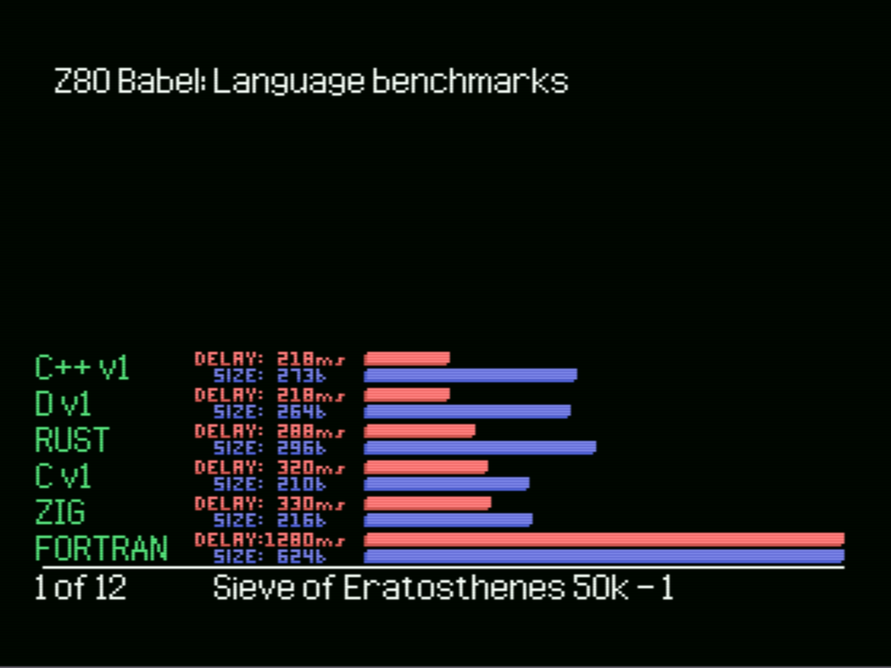
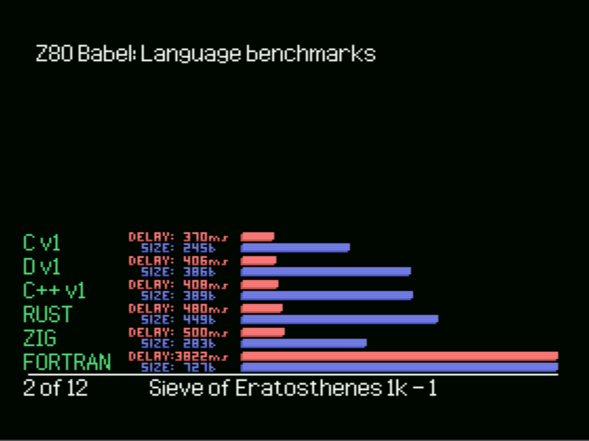
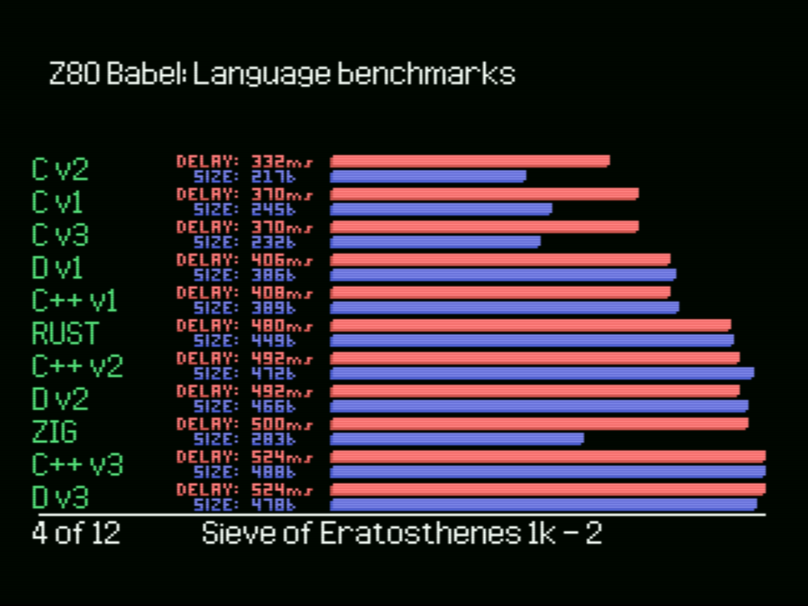
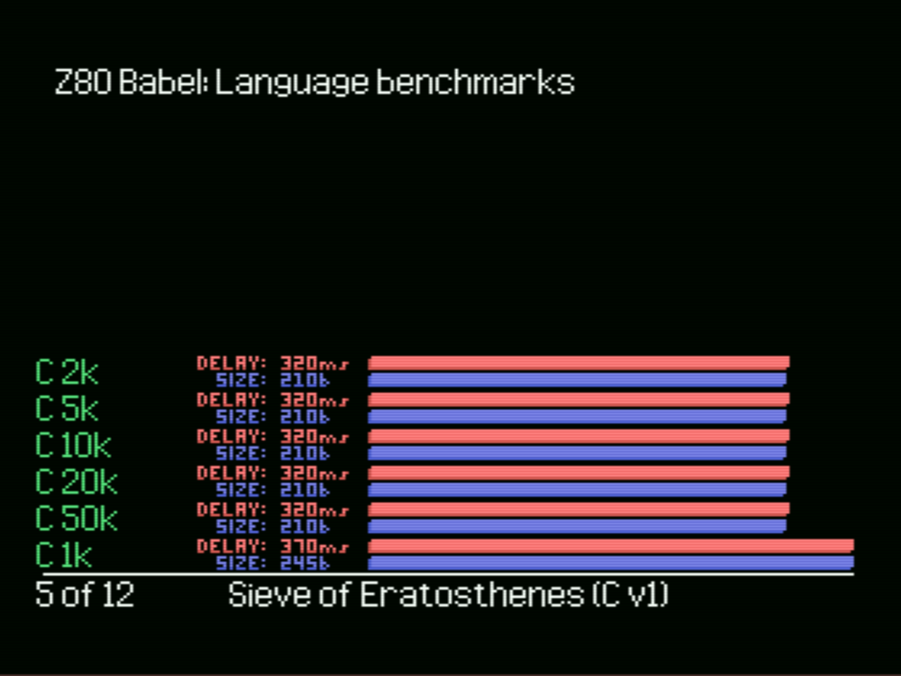
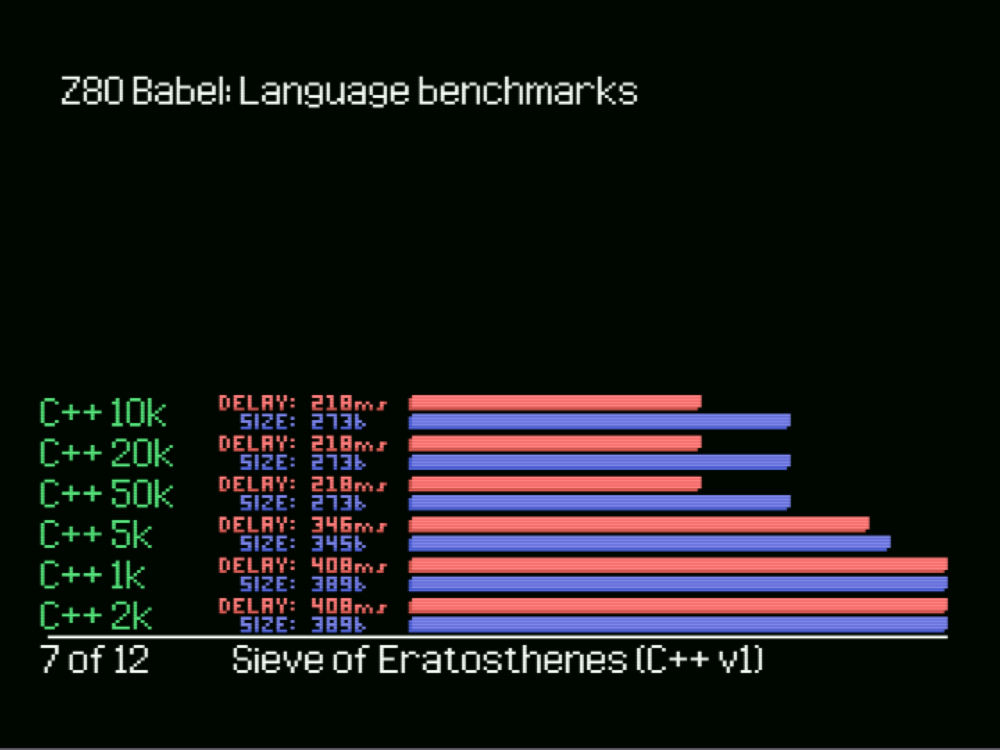
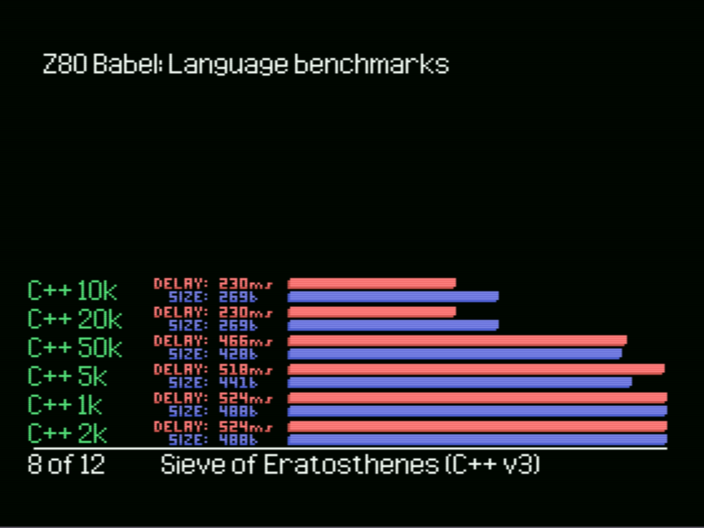
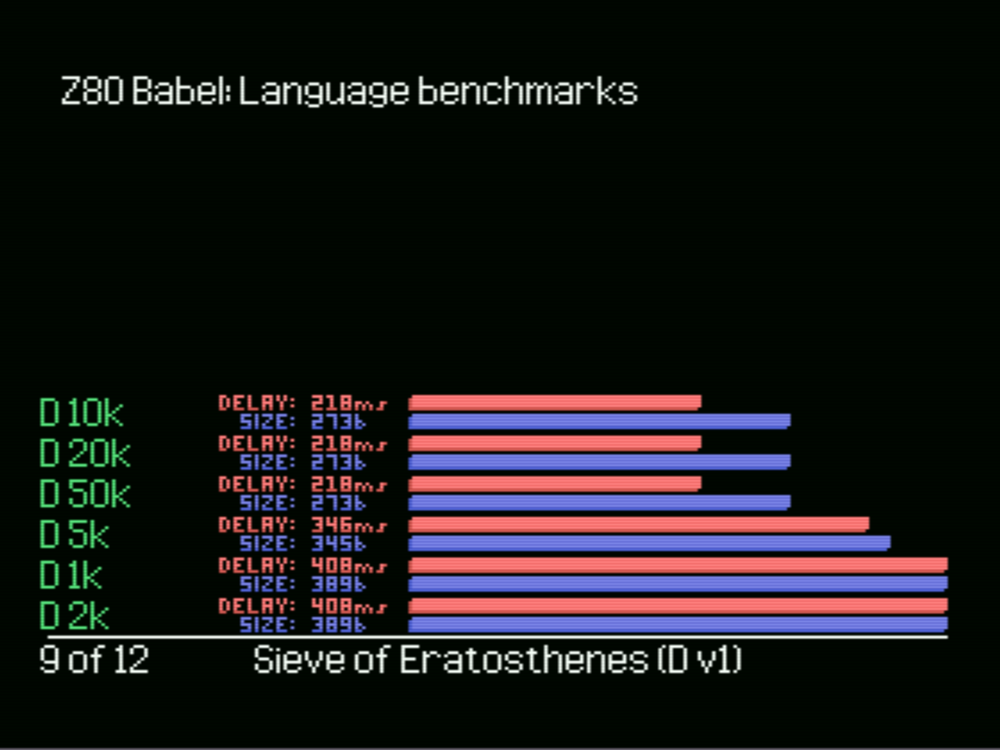
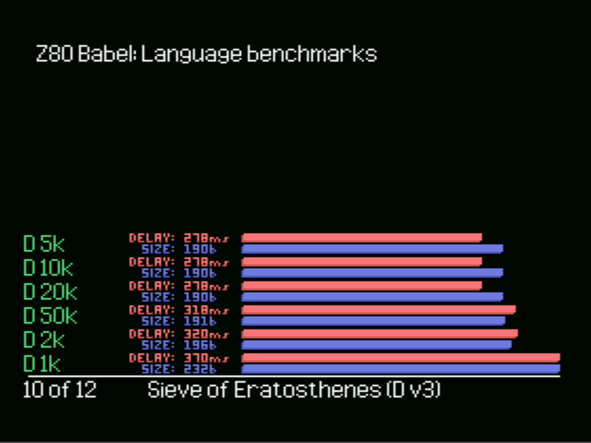
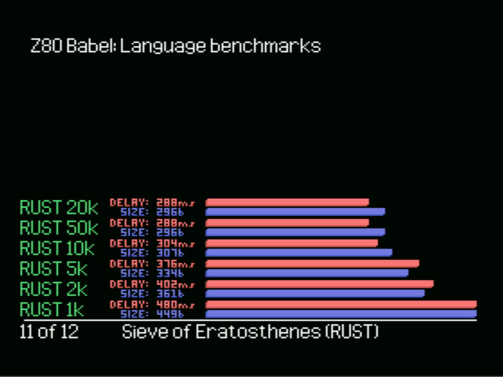
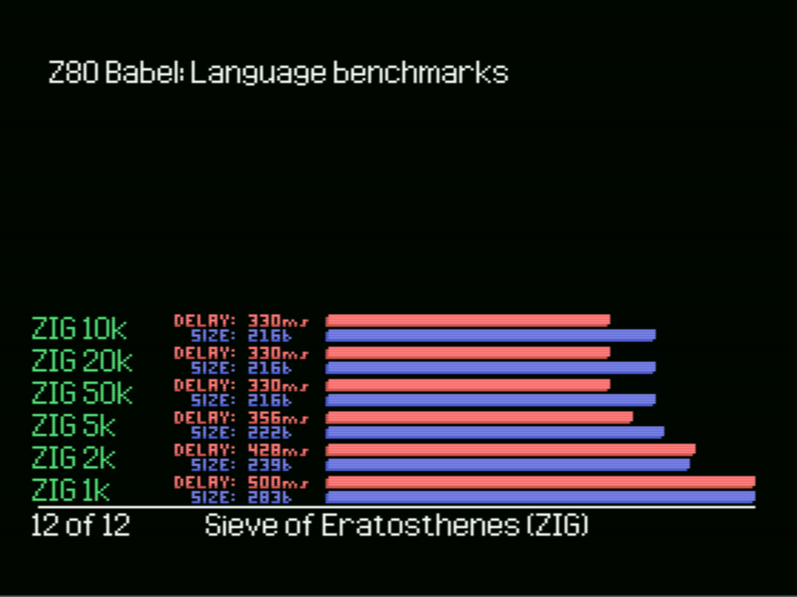

# z80_babel: C, C++, D, Fortran, Rust and Zig for your z80

This is a proof of concept for a multi-language pipeline for the Z80 CPU, and its corresponding test and benchmark tool coded for MSX. This is the result of using a large amount of monkeys randomnly duct-taping different compilers until a working prototype was created.

Most surprisingly, it IS possible to use C++, D, Fortran, Rust or Zig to generate binaries for the Z80, and even more surprisingly, these have competitive performance (except for Fortran, but maybe we can live with that). Support for their respective standard libraries is somewhat limited (a.k.a inexistent).

## Documentation
To compile C we use SDCC. To compile C++, Rust, D, Zig or Fortran, we use the llvm-cbe backend to generate a C file rom the llvm intermediate representation, and we compile this C file to Z80 assembly using SDCC. The key that makes this possible is using the AVR target for the llmv frontends. I could not get Fortran to accept the AVR target, and thus it incurrs on a large performance penalty.

Real documentation will come in its due time. I do welcome any help in cleaning and documenting this approach. 

## Current Benchmarks
The only implemented benchmark currently is the sieve of Eratosthenes. The implemented algorithm is naïve, and it has the same complexity in all languages.
C, C++, and D implement three closely related versions of the algorithm (v1, v2, v3). The "1k"..."50k" indicate the number of allocations allowed for SDCC, the number of allocations controls the optimization level for SDCC, with more allocations generally corresponding to more optimized code. The code coming from LLVM tends to leverage better high optimization levels. 

